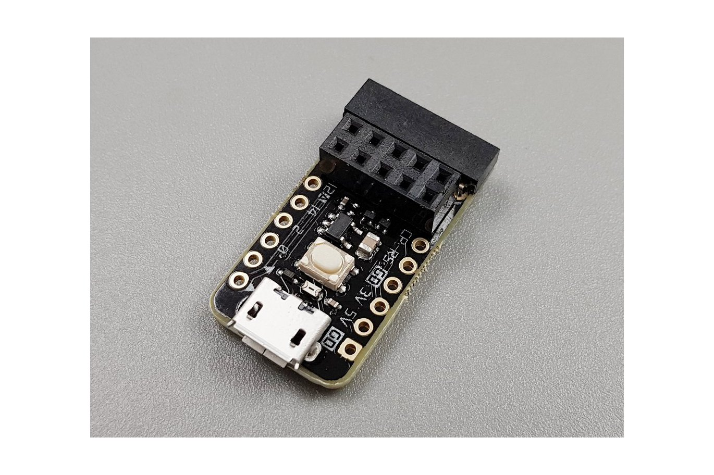

# ThingSpeakPortal
This is a small esp8266-01 sketch that listens for json strings on the serial port, parses them and then sends the fields to a ThingSpeak channel. ThingSpeakPortalClient is a class that can be dropped into your arduino code to simplify pushing data to your ThingSpeak channel through your ThingSpeakPortal device.

| file                      | purpose * |                                                                                   |
| ------------------------- | :-------------------------------------------------------------------------------------------- |
| ThingSpeakPortal.ino      |  This is the sketch that should be loaded onto the ESP8266-01 that is being                   |
|                           |    used as the portal.                                                                        |
| ThingSpeakPortalClient    |  These are the .h and .cpp files that should be added to the arduino sketch that is           |
|                           |    that is communicating with the portal over a serial connection.                            |

# programming
I've been using a usb flashing tool, BB-ESPADP, that I found on Tindie.  This thing is really slick and makes programming these little ESP8266-01 boards pretty painless.
  
*BB-ESPADP Programmer Board*
